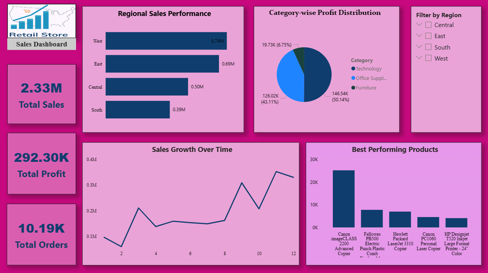

# Sales Analytics Dashboard

## Project Overview

This project focuses on analyzing retail sales data to extract meaningful business insights.
The objective is to understand sales performance, profit trends, and product-level analysis using multiple data analytics tools.

---

## Objectives

* Analyze sales and profit performance
* Identify top-performing regions and products
* Detect loss-making products
* Visualize trends for better decision-making

---

## Dataset

* Superstore Sales Dataset
* Contains ~10,000+ records
* Includes:

  * Customer details
  * Product details
  * Sales, Profit, Discount
  * Region and Category
  * Order Date

---

## Tools & Technologies Used

* Python (Pandas) → Data Cleaning
* SQL (MySQL) → Data Analysis
* Microsoft Excel → Data Summarization
* Power BI → Dashboard Visualization

---

## Project Workflow

### 1. Data Cleaning (Python)

* Loaded dataset using Pandas
* Handled missing values
* Converted date columns
* Created Month and Year columns

---

### 2. Data Analysis (SQL)

* Imported cleaned data into MySQL
* Performed queries to analyze:

  * Sales by region
  * Top products by profit
  * Monthly sales trends

---

### 3. Data Analysis (Excel)

* Created pivot tables
* Built charts for quick insights

---

### 4. Dashboard Creation (Power BI)

Developed an interactive dashboard including:

* KPI Cards (Total Sales, Total Profit)
* Sales by Region
* Monthly Sales Trend
* Top Products by Profit
* Category-wise Profit
* Filters (Region, Category)

---

## Key Insights

* West region generated the highest sales
* Technology category contributed the highest profit
* Some products resulted in losses due to high discounts
* Sales showed a consistent monthly growth trend

---

## Dashboard Preview

  

---

## Project Structure

Sales-Analytics-Project/
│
├── dataset/
├── python/
├── sql/
├── excel/
├── powerbi/
├── images/
└── README.md

---

## Conclusion

This project demonstrates an end-to-end data analytics workflow from data cleaning to visualization.
It helps in understanding business performance and supports data-driven decision-making.

---

## Author

Bhargavi Lankapalli

---
